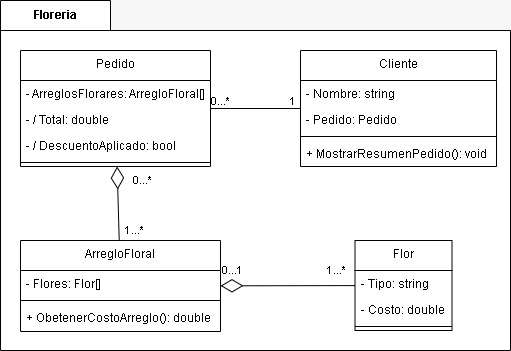

<h1 style="text-align: center; text-decoration: underline; font-size: 34px; font-weight: bold">Parcial</h1>

# 1. Elaborar un diagrama de clases a partir del siguiente enunciado (3pts):

Una empresa de transporte está buscando un sistema para gestionar su flota de vehículos. En la flota tienen dos tipos de vehículos: Camiones y Autobuses. Todos los vehículos tienen en común ciertas características como el número de matrícula, el año de fabricación y el kilometraje.

Sin embargo, cada tipo de vehículo tiene características propias. Los Camiones tienen una capacidad de carga medida en toneladas, mientras que los Autobuses tienen un número de asientos.

Los vehículos son manejados por conductores, quienes pueden ser asignados a un vehículo en particular.
(Los conductores tienen un nombre, una licencia de conducir y una fecha de contratación). Además, un supervisor de flota se encarga de registrar el mantenimiento regular de los vehículos. La empresa necesita un sistema que permita consultar el estado de los vehículos y saber cuándo se debe realizar el siguiente mantenimiento (el supervisor, para realizar esta tarea, debe conocer el nombre del vehículo, la fecha del último mantenimiento y la cantidad de kilómetros recorridos desde entonces.).

Por ejemplo, el camión con matrícula "AB123CD" tiene una capacidad de 12 toneladas y ha recorrido 50,000 km. Mientras tanto, el autobús con matrícula "XY456ZT" tiene 45 asientos y ha recorrido 30,000 km. El sistema debe ser capaz de mostrar información general sobre los vehículos y también sobre los detalles específicos según el tipo de vehículo.

# 2. Volcar el siguiente diagrama de clases en código (3pts):

Una florería está buscando un sistema para gestionar los pedidos de sus clientes. Cada cliente puede hacer un pedido de uno o más arreglos florales. Los arreglos florales pueden estar hechos de diferentes tipos de flores, y cada flor tiene un costo específico. El sistema debe calcular el total del pedido basándose en la cantidad y tipo de flores seleccionadas para cada arreglo floral.

El dueño de la florería también quiere que el sistema lleve el registro de los descuentos que se pueden aplicar a los pedidos en función de la cantidad de arreglos florales que se pidan. Si el cliente pide más de 5 arreglos florales, se le debe aplicar un descuento del 10% sobre el total. El sistema también debe permitir registrar el nombre del cliente y mostrar un resumen del pedido, incluyendo el total a pagar con y sin descuento.

<section align="center">
  
</section>

# 3. Con el siguiente enunciado, elaborar un diagrama de clases y luego volcarlo a código (4pts):

En un pequeño gimnasio local, el administrador ha notado que con el aumento de miembros, el proceso de asignar instructores a las clases y mantener un registro adecuado de las inscripciones se ha vuelto complicado. Los miembros pueden inscribirse en varias clases, y cada clase tiene un instructor asignado. Además, para cada clase, el gimnasio necesita saber cuántos lugares están disponibles y el costo por clase.

El administrador quiere un sistema en el que pueda llevar un control más organizado de las inscripciones. Los instructores deben tener información básica como su nombre y experiencia, y cada miembro debe tener registrado su nombre y número de miembro. Cuando un miembro se inscribe en una clase, el sistema debe reducir automáticamente el número de lugares disponibles.

### Requisitos:

1. El gimnasio ofrece varias clases, y cada clase tiene un instructor asignado.
2. Los miembros del gimnasio pueden inscribirse en una o más clases.
3. Cada clase tiene un número limitado de lugares y un costo.
4. Los instructores tienen información básica, como nombre y experiencia.
5. Cuando un miembro se inscribe en una clase, se debe reducir la cantidad de lugares disponibles.
